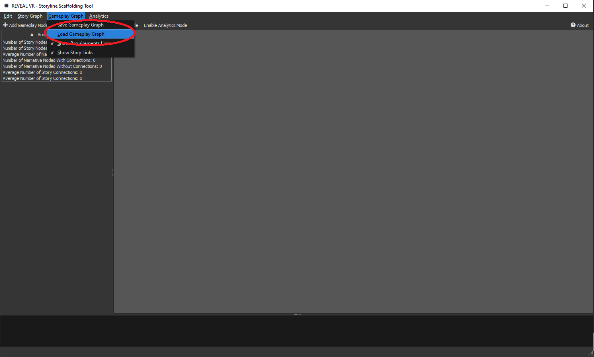
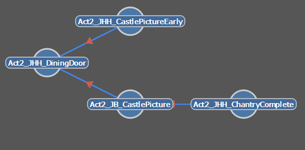
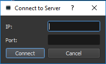
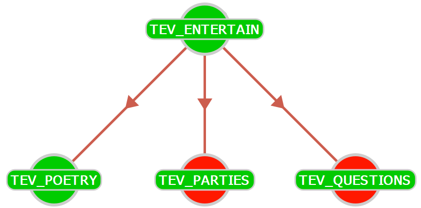

# About

Stories are considered as essential in serious games. However, in practice, stories and gameplay are often developed by separate teams, leading to a sub-optimal match between these. On top of this, there are few easy-to-use dashboards for real-time visual serious game analytics to assess gamer behavior.

The Storyline Scaffolding Dashboard (SSD) supports real-time serious game analytics by explicitly encoding, visualizing, and linking both the story and gameplay as node trees in real-time. This helps in game development by ensuring that there is a perfect match between the story and gameplay. Moreover, this design allows for visually aesthetic real-time player analytics to view a player through a game in real-time and evaluate their performance.

The SSD is written in modern C++, using C++11 features, in Qt and is based on the ZodiacGraph, a node graph user interface module ([https://github.com/clemenssielaff/ZodiacGraph](https://github.com/clemenssielaff/ZodiacGraph)). Both the SSD and ZodiacGraph are released under the MIT license.

This project was funded from the European Union&#39;s Horizon 2020 research and innovation program under grant agreement No 732599, the _REVEAL_ project ([www.revealvr.eu](http://www.revealvr.eu/)).

# Acknowledgments

Thank you to the participants of the REVEAL project for suggestions for features and testing the tool. Also, thank you to Clemens Sielaff for developing ZodiacGraph and making it freely available for use as a base.

# Executable

The executable file is in the /bin folder (SSD.exe) along with the requirements to run.

# Requirements

Although untested, approximate minimal hardware requirements for running the SSD are:

- 256 MB of RAM
- 500 MHz CPU, 1 GHz
- OpenGL ES 2.0 support

To launch, the SSD needs the &quot;commandsandparams.json&quot; file. This contains the commands, and parameters, for the gameplay graph. An example file is provided. More information is available in the &quot;Commands&quot; subsection of the &quot;Gameplay Graph&quot; section.

# Installation

## Qt Creator

Open the project file &quot;Dashboard.pro&quot; in QtCreator. After configuring the build directories, choose the play option and the dashboard should open.

## QMake

Open the Qt command line to make sure that all Qt-libraries are available on the path, call vcvarsall.bat and define the target machine type (x86 or x64). In the repository, run:

_qmake
 nmake release
 release\Story\_Scaffolding\_Dashboard.exe_

# Videos

The gameplay graph lighting up and sidebar updating as a player progresses through the game (old version) – [https://www.youtube.com/watch?v=4Jw7JMxfvuo](https://www.youtube.com/watch?v=4Jw7JMxfvuo).

# Full Documentation

Full Doxygen documentation to come soon.

# Story Linking Functionality

## Story Graph

### Overview

The SSD&#39;s representation of a story is based on Story Grammar Theory [Thorndyke, 1977, DOI: [https://doi.org/10.1016/0010-0285(77)90005-6](https://doi.org/10.1016/0010-0285(77)90005-6)], which defines a story into four main parts: setting, theme, plot, and resolution. Subsequently, these parts can be rewritten into more sections using 10 available rules, as shown in the figure below.


For example, settings consists of characters, location, and time and the plot consists of episodes that contain attempts, outcomes, and a subgoal. For example, in The Chantry, an event is &quot;smallpox is a horrifying disease&quot; and an outcome of one episode is &quot;James developed a mild fever, but quickly recovered&quot;. These rules provide a hierarchical representation of the story, known as the story graph, providing a mental schema of how a story unfolds. The graph will be explained in detail using parts of the story in the Example subsection.

### Usage

#### Creating a Story Graph

To create a story within the tool, first select the &quot;Add Story Graph&quot; option.


#### Adding Nodes

This will create the base of a Story Graph (setting, theme, plot, and resolution), more nodes are added by right-clicking on a node to and selecting an option to create a child.


This can be done for all nodes that accept children as defined in the schema.

   

#### Editing Node Names and Descriptions

When a node is clicked on, it can be edited in the sidebar, as shown below. The name (ID) of the node and description (story sentence) can be edited in the sidebar. This is not possible for the prefix. This also shows the parent and children of the node, as well as links to gameplay nodes (see the linking section). A node name change in the sidebar will be reflected in the graph.


#### Removing Nodes

If a node has no children and is not mandatory, it can be removed. This can be done in two ways:

- Selecting a node and clicking the delete node button in the sidebar (as shown above)
- Clicking with the middle mouse button on the node

#### Saving a Story Graph

To save the story graph, select the &quot;Story Graph&quot; menu and select &quot;Save Story&quot;.


The story will be saved as a JSON file in the location chosen through the dialog box.


#### Loading a Story Graph

To load the story graph, select the &quot;Story Graph&quot; menu and select &quot;Load Story&quot;.


A dialog box will appear to load the story graph.


Once selected, this will load the story graph into the tool.

#### JSON Schema

Coming soon.

### Example

#### Story

1. The Chantry
2. is a country house
3. in Berkeley,
4. near to the River Severn in the county of Gloucestershire, England.
5. It stands between Berkeley Castle and the church
6. and was originally built as housing for priests
7. In 1823
8. it was the home to a physician and widower
9. called Edward Jenner
10. Jenner also had a second home in Cheltenham
11. Jenner&#39;s main work was on birds and cuckoos
12. Yet he and his colleagues carried out many interesting experiments
13. Which scared a lot of people
14. Including improving grass growth using human blood
15. And launching balloons
16. Jenner turned his attention to the study of smallpox
17. after observing that dairymaids appeared to be protected from smallpox after having suffered from cowpox
18. He was told this by Sarah Nelmes
19. a milkmaid
20. Cowpox resembles a mild form of smallpox
21. Smallpox is a horrifying disease
22. which killed 1 in 5 people who caught it
23. and scarred and/or blinded many other
24. It affected both rich and poor people
25. Queen Mary II of England
26. Was killed
27. and Beethoven and Mozart
28. Were left scarred
29. Some people couldn&#39;t live with the terrible scarring and took their own lives
30. Once someone had had smallpox they couldn&#39;t get it again
31. Smallpox scars were an asset to servants seeking employment as it showed they couldn&#39;t bring the disease into a household
32. Jenner was immune to smallpox
33. as he went through the process of inoculation when he was younger
34. Inoculation involved deliberately infecting someone with smallpox by scratching pus from a smallpox scar into their bloodstream
35. This induced a milder form of smallpox which most people survived
36. and gave them future immunity to the disease
37. Inoculation was used in Africa and Turkey before it came to Europe and America.
38. Lady Mary Wortley Montagu
39. brought the practice of variolation to England from Turkey
40. The Reverend Cotton Mather
41. brought inoculation to The Americas after being taught the practice by an African slave
42. However, other preachers regarded thee process as sinful
43. Jenner took the practice one step further by using an inoculant which came from a related non-fatal disease (cowpox)
44. In 1796
45. Jenner extracted the pus from cowpox lesions on a milkmaid&#39;s arm
46. and scratched this onto the arm of an 8-year old boy called James Phipps
47. to see if this made him immune to smallpox
48. James developed a mild fever but quickly recovered.
49. Eight weeks later Jenner injected James with pus from a fresh smallpox lesion
50. No disease developed,
51. and Jenner concluded that Phipps was now protected against smallpox
52. Jenner was working at the time of the Napoleonic Wars between Britain and France
53. but still helped the French people
54. and was held in high regard by Napoleon
55. who spent thousands of francs promoting vaccination throughout his empire

#### Story Graph


##### Setting

Setting consists of characters, locations, and times. These accept unlimited states (referred to as details in the SSD). For example, The Chantry (location) is described as &quot;a country house&quot; (detail/state).

##### Theme

The theme consists of events, which have happened to set up the story, and goals, the desired state. Events and goals can have children: sub-events and sub-goals, respectively. These children can also have children. For example, &quot;Smallpox is a horrifying disease&quot; is an event with the sub-event &quot;which killed 1 in 5 people who caught it&quot; and &quot;Once someone had had smallpox they couldn&#39;t get it again&quot; is a goal with the sub-goal &quot;Smallpox scars were an asset to servants seeking employment as it showed they couldn&#39;t bring the disease into a household&quot;.

##### Plot

The plot is the most complicated part of the story graph and covers the key events in the story.

Attempts and outcomes can also have sub-episodes. For example, an episode that goes through other types of immunity before vaccination has a sub-episode discussing inoculation.

##### Resolution

The resolution is the end of the story and consists of events and states. The events reference the events that happened at the end of the story, such as &quot;the British Parliament eventually granted Edward Jenner a grant of £10,000 for his smallpox research&quot; and states reference the end state, such as &quot;The smallpox virus was finally eradicated in 1980 following a global immunization campaign led by the World Health Organisation&quot;.

#### JSON Snippet

```json
{
    "episodes": [{
            "attempts": [{
                "description": "Jenner was working at the time of the Napoleonic Wars between Britain and France",
                "id": "ATT_WARS"
            }],
            "description": "Napoleonic Wars",
            "id": "EP_NAPOLEON",
            "outcomes": [{
                    "description": "who spent thousands of francs promoting vaccination throughout his empire",
                    "id": "OUT_EMPIRE"
                },
                {
                    "description": "and was held in high regard by Napoleon",
                    "id": "OUT_HIGHREGARD"
                }
            ],
            "subGoal": {
                "description": "but still helped the French people",
                "id": "SUBG_HELPED"
            }
        }

    }
```

## Gameplay Graph

### Overview

The Gameplay Graph is a behavior tree that triggers sequences of voiceovers, sound effects, animations and changes in lighting as well as the functionality to unlock new areas of the environment. When a gameplay node is accessed, through interactions with the game environment, it triggers optional command blocks. Each command block dispatches a list of commands.

Gameplay nodes can be either:

- Locked (although unlockable if all dependencies met)
- Being Unlocked
- Already Unlocked

A gameplay node may depend upon previous nodes whose state determines if this node is available. Therefore, this graph represents the progress of the player through the game. Different states trigger different events so the event triggered for a locked node can be different to the event for an unlocked node.

Decorators are used to make dependencies more complicated; these are:

- Sequencer (logical AND operation)
- Selector (logical OR operation)
- Inverter (logical NOT operation)
- Leaf (a gameplay node test to check if it is active)

As mentioned, these gameplay nodes trigger events, which are represented by commands. These are represented by the ID of the command/event to be triggered and a list of parameters.

Multiple game graphs can be created, saved and loaded within the tool. This is so multiple files can be created for different areas of the game should developers wish to do so.

### Usage

#### Creating a Gameplay Node

To create a gameplay node within the tool, first select the &quot;Add Gameplay Node&quot; option.


#### Editing a Gameplay Node

When a node is clicked on, it can be edited in the sidebar, as shown below. The name (ID) of the node and (optional) description can be edited in the sidebar and the three possible command paths (node is locked, being unlocked or already unlocked) can be added to or changed. The filename that the node will be saved to, along with other gameplay nodes with the same filename, can also be set. The links to story nodes and dependencies (see Linking section) are also visible.


For each of the three options for triggering commands:

- OnUnlock – Node being unlocked
- OnFail – Node locked
- OnUnlocked – Node already unlocked

lists of commands can be added (using the plus icon), removed (using the minus icon) or edited. The commands are selectable through dropdown boxes, which, in turn, show the parameters that can be set through simple text boxes.

These commands and parameters are set in the &quot;commandsandparams.json&quot; file (see Commands and Parameters File subsection).

#### Loading Gameplay Graphs

To load gameplay graphs, select the &quot;Gameplay Graph&quot; menu and select &quot;Load Gameplay Graph&quot;.



A dialog box will appear to load the gameplay graphs.


When loading, the user will need to place these graphs in the desired order. 


The graphs will then show in the tool.


#### Saving Gameplay Graphs

To save gameplay graphs, select the &quot;Gameplay Graph&quot; menu and select &quot;Load Gameplay Graph&quot;.


The gameplay graphs will be saved as JSON files in the location chosen through the dialog box.


#### Commands and Parameters File

As mentioned at the beginning of this guide, the &quot;commandsandparams.json&quot; file is needed to start the tool and holds the information for gameplay commands and associated parameters. A sample file is provided. An example is provided.

This file contains an array of possible parameters, such as the &quot;Time&quot; parameter (how many seconds to wait before triggering a command):

```json
{
    "label": "Time",
    "id_name": "time",
    "type": "float"
}
```

As shown above, this object consists of a label that is shown in the tool, the id for the JSON file and the type of value that is accepted.

A separate array contains the commands, such as the &quot;Add Subtitle&quot; command:

```json
{
    "label": "Add Subtitle",
    "id_name": "add_subtitle ",
    "params": ["time", "text_id"]
}
```
As shown above, this object consists of a label that is shown in the tool, id for the JSON file and the parameters that it uses.

#### JSON Schema

Coming soon

### Example

#### Description

The &quot;Chantry&quot; gameplay graph is a gameplay graph for a task in &quot;The Chantry&quot; game, which starts when a dining room door is accessed. When this first gameplay node (Act2\_JHH\_DiningDoor) is triggered (on\_unlock), the player is played an audio narrative and a task list appears, showing an item to be found and turned over (Act2\_JB\_CastlePicture). If the player tries the door again (on\_unlocked), they hear the sound of a locked door trying to be opened. If the player finds the item (Act2\_JHH\_CastlePictureEarly) before the first node has been unlocked (on\_fail), they are played an audio file telling them the item isn&#39;t useful right now. If the first node is unlocked (on\_unlock), an audio narrative plays telling the player that the item is useful. On turning the item over (Act2\_JHH\_CastlePicture), another audio narrative plays and the door unlocks. Putting the item down completes the task (Act2\_JHH\_Chantry\_Complete). Picking up and turning the item over later (on\_unlocked), plays the audio narrative again.

#### Graph



#### JSON Snippet

```json
[
    {
        "id": "Act2_JHH_DiningDoor",
        "on_unlock": [
            {
                "cmd": "focus_screen",
                "time": 0
    },
            {
                "cmd": "add_subtitle",
                "time": 0
    },
            {
                "cmd": "play_sound",
                "id": "narr/Act2_JHH_DiningDoor",
                "time": 0
    }],
        "on_unlocked": [
            {
                "cmd": "play_commands",
                "id": "door_barred_gen",
                "time": 0
    },
            {
                "cmd": "show_cl_progress",
                "id": "LS_CL_CHANTRY",
                "time": 0
    }],
        "story_tags": [
        "LOC_CHANTRY"
    ]
},
    {
        "id": "Act2_JHH_CastlePictureEarly",
        "on_fail": [
            {
                "cmd": "add_subtitle",
                "time": 0
    },
            {
                "cmd": "focus_screen",
                "time": 0
    },
            {
                "cmd": "play_sound",
                "id": "narr/Act2_JHH_CastlePictureEarly",
                "time": 0
    }],
        "on_unlock": [
            {
                "cmd": "play_commands",
                "id": "closer_look_gen",
                "time": 0
    }],
        "requirements":
        {
            "id": "Act2_JHH_DiningDoor",
            "type": "LEAF"
        }
},
    {
        "id": "Act2_JB_CastlePicture",
        "on_unlock": [
            {
                "cmd": "focus_screen",
                "time": 0
    },
            {
                "cmd": "play_sound",
                "id": "narr/Act2_JB_CastlePicture",
                "time": 0
    },
            {
                "cmd": "add_subtitle",
                "time": 0
    }],
        "on_unlocked": [
            {
                "cmd": "play_commands",
                "id": "@Act2_JB_CastlePicture_on_unlock",
                "time": 0
    }],
        "requirements":
        {
            "id": "Act2_JHH_DiningDoor",
            "type": "LEAF"
        },
        "story_tags": [
        "DET_CASTLE"
    ]
},
    {
        "id": "Act2_JHH_ChantryComplete",
        "on_unlock": [
            {
                "cmd": "focus_screen",
                "time": 0
    },
            {
                "cmd": "play_commands",
                "id": "door_creak_gen",
                "time": 0
    },
            {
                "cmd": "add_subtitle",
                "time": 0
    },
            {
                "cmd": "try_close_logic_node",
                "duration": 0,
                "id": "DiningRoom_Door_Interaction_Logic",
                "time": 0
    },
            {
                "cmd": "try_open_logic_node",
                "duration": 1.5,
                "id": "DiningRoom_Door_Logic",
                "time": 0
    },
            {
                "cmd": "play_sound",
                "id": "narr/Act2_JHH_ChantryComplete",
                "time": 0
    }],
        "requirements":
        {
            "id": "Act2_JB_CastlePicture",
            "type": "LEAF"
        },
        "story_tags": [
        "DET_PRIESTS"
    ]
}
]
```

## Linking

To meet the key aim of the tool: being able to structure and visualize the story (educational content) within the game, the gameplay graph must be linked to the story graph to show where each of the story elements are present in the game. Moreover, to structure the gameplay graph, the same functionality must be available to add dependencies to different gameplay nodes. Therefore, nodes will be linked as either gameplay-story links or, when both nodes are gameplay, requirements lists, a list of nodes that must be unlocked before the selected node is unlockable).

To link a gameplay node to another node, story or gameplay, the gameplay node which needs to be linked to a story node or needs a requirements list to be created must be right-clicked on.


Clicking the option to link this node to other nodes, shows a dialog window. This window contains separate tabs that list gameplay and story nodes respectively.

 

Checking the boxes for story nodes will result in simple links being made to story nodes and checking the three-state boxes for other gameplay nodes will result in requirements links being made between these nodes; this includes adding a sequence decorator if more than one node has been checked to show that this node requires a sequence of nodes to be unlocked or an inverter if the third (negative) state of the checkbox is selected.

### Linking Analytics

To provide feedback to the user, story nodes that are not referenced in the gameplay graph will have red-colored labels, rather than green labels, to show that this part of the story is missing from the game.


On top of this, the sidebar shows calculations of story completeness:

- Number of Story Nodes with Connections
- Number of Story Nodes Story Connections
- Average Number of Gameplay Connections
- Number of Gameplay Nodes with Connections
- Number of Gameplay Nodes without Connections
- Average Number of Story Connections
- Total Number of Gameplay-Story Connections


These two aspects make it makes visible and computable how complete –and where – the story is represented in the gameplay layer.

## Example of Use

A gameplay node, &quot;Act2\_JHH\_ CastlePicture&quot;, has the following audio narrative attached: &quot;_It was called &quot;The Chantry&quot;, from having, in former times, been in the possession of certain monks. It is contiguous to the churchyard of Berkeley Castle, and the tower of St Mary&#39;s Church over-hangs the southern boundary of the shrubbery_&quot;. This is related to a node in the story graph, &quot;DET\_CASTLE&quot; (see story graph example point 5), which reads: &quot;_It stands between Berkeley Castle and the church_&quot;. Therefore, this gameplay node is linked to the story node.

# Real-time Analytics

As a result of the gameplay-story linking and the presentation of these two nodes, real-time analytics for following and assessing a player, as they move through a game, become available.

## In-Game Tasks

### Overview

In most games, players must complete tasks to proceed. To make use of the live analytics, using the node trees, these tasks are imported into the tool. Tasks generally consist of the following:

1. Task Name
2. Start Point
3. End Point
4. Objective(s) with name

The tool accepts a JSON file that contains these elements:

1. Task Name = text\_id string
2. Start Point = begin\_dep string
3. End Point = complete \_dep string
4. Objective(s) with name = narrative\_deps array with narr\_id string

#### Usage

Go to the analytics menu and select &quot;Add/Edit Tasks&quot;.


A dialog box will appear giving options to load and save a task, along with options for spatial graph and a starting node (see spatial graph subsection in the lostness section).


Tasks are loaded through a file dialog.


And result in the necessary variables for tasks being loaded into the tool (calculate lostness and the minimum step variables are explained in the lostness section).


These tasks can then be used for real-time analytics.

#### Example

(Shortened to remove variables used in the game)

```json
{
    "narrative_deps": [
        {
            "narr_id": "Act2_JHH_CountyMap",
      },
        {
            "narr_id": "Act2_EJ_LastLetter",
            "subtitle": "LS_CL_GLOUCESTERSHIRE_LASTLETTER",
            "decal_id": "Act2_EJ_LastLetter_Decal"
      }
    ],
    "text_id": "LS_CL_GLOUCESTERSHIRE",
    "begin_dep": "Act2_JHH_BreakfastDoor",
    "complete_dep": "Act2_JHH_HomeComplete"
}
```

##### JSON Schema

To Follow

### Lostness

To assess how well a player has completed tasks, the lostness measure is used within the tool. This measure is originally from hypertext and used to identify disorientation. It has shown to be successful in predicting success in information-seeking tasks in hypertext. It is possible to implement in games if tasks/objectives can be defined in a minimum number of steps and steps a player has taken can be logged. The values needed are:

- The minimum number of steps needed to complete a task/objective (*R*)
- The total number of steps taken (*S*)
- The unique number of steps taken (*N*)

For a given task, the lostness (*L*) is defined as follows:


This returns a value between 0 and √2, which is converted to a percentage in the SSD. A player with a 0% lostness value has taken the perfect path and a value close to 100% indicates that a player is completely lost and highly disoriented. The \SSD provides two lostness implementations, based on two types of information-searching tasks: i) global gathering activities, where target information is spread and must be combined and ii) local fact-finding activities in case information is located in a single place [Puerta Melguizo et al., 2012, DOI: [https://doi.org/10.1016/0010-0285(77)90005-6](https://doi.org/10.1080/0144929X.2011.602425)].

#### Global Lostness

Global lostness compares the steps made by the player (*S* and *N*) during a task with user-defined minimum steps (*R*). This provides a value of lostness for each task (see formula in Lostness section). These values are scaled for the full game using a weighted average, using the number of objectives to reflect the complexity of each task. Weighted global lostness for the full game is defined as:


where *t* represents task and *x* is the total number of objectives within a task.

#### Local Lostness

Local lostness compares the steps taken by a player ($S$ and $N$) to each objective with the minimum steps (*R*) calculated through a path-finding algorithm. This effectively follows the complete path of the player through the game so, rather than using a weighted mean, the *R*, *S*, and *N* values from each objective can simply be summarized and fed into the lostness equation (see formula in Lostness section).


#### Calculation Options

An option exists, in the tasks dialog, to calculate lostness in the tool or from the game. This lostness value can be received in an interaction object (see Interaction Object subsection in the Network section) or within the tool.

For global lostness, the tool uses the minimum steps value in the tasks dialog. Local lostness makes use of a pathfinding algorithm to calculate this value (see next section). Both measures use a list of accepted verbs received through an interaction object to calculate the S and N value for the player:

- Moving to a new location – &quot;moved to&quot;
- Picking up an item – &quot;picked up&quot;
- Examining (turning over) an item – &quot;examined&quot;

##### Spatial Graphs and Pathfinding

Additional information coming soon.

## Network

To receive the necessary information for live analytics, information is transferred to the tool from the game.

### Connection

The SSD must connect to a TCP server, as a client, that will send JSON interaction objects. This server can either run within the game or the game can send these objects to a server, which will send these to the SSD.

To connect to a server, click &quot;Enable Analytics Mode&quot;, then, from the &quot;Analytics&quot; menu, select &quot;Connect to server&quot;.


This dialog will appear for an IP and port number (domains are also accepted).



A dialog will appear showing if the connection is successful. Connection issues are not detailed here.

### Interaction Object

The SSD uses the Serious Games Interactions Model (SGIM). This consists of:

- Player name
- Action (verb)
- Object
- Timestamp (ISO 8601)
- Optional value ()

Common verbs used in the SSD are

- &quot;moved to&quot; – When a player moved
- &quot;picked up&quot; – When a player picks up an object
- &quot;examined&quot; – When a player examines (turns over) an object
- &quot;started&quot; – When a player starts a task
- &quot;completed&quot; – When a player starts a task
- &quot;attempted&quot; – When a player attempts to unlock a narrative node (contains result of fail, unlock or unlocked), which can indicate an objective has been found

For more information, and the correct format, see [https://github.com/e-ucm/xapi-seriousgames](https://github.com/e-ucm/xapi-seriousgames).

Additionally, the SSD allows an optional &quot;lostness&quot; variable for an &quot;unlock&quot; or &quot;completed&quot; verb when the game calculates lostness rather than the tool.

#### Example Interaction

```json
{
    "actor": "Player 1",
    "object": "Act1_EJ_BerkleyHome",
    "result":
    {
        "result": "unlock"
    },
    "timestamp": "2019-10-26T14:57:44Z",
    "verb": "attempted"
}
```

## Logging

When the JSON data is received from the server, this is logged in full to a text file to be examined in full at a later time if necessary. This will contain all events in case different types of analytics or in-depth examination of the gameplay data if necessary. In addition to this, a log widget is available at the bottom of the tool which shows human-readable sentences derived from the JSON data. Through this, a teacher or researcher can see the current progress of a player in the game in text format.


## &quot;Lighting-Up&quot;

In addition to the primitive text logger, the JSON data is also used to &quot;light up&quot; the gameplay and story graphs. This will be done when a gameplay node is unlocked (interaction object with &quot;attempted&quot; verb and &quot;unlock result&quot;) which then allows other nodes to be unlocked and will use the following color scheme:

- Red – Node locked
- Blue – Node can be unlocked
- Green – Node unlocked


In addition, story nodes attached to these nodes will also be highlighted when these have been accessed. These will simply be red when they have not been accessed and green when they have. This shows the gameplay events that the player has interacted with and the story information/educational content they have been exposed to and, hopefully, learned.



## Sidebar

When the user enters analytics mode. Tasks populate in the sidebar. Progress bars are used to show the progress the player has made through the task as well as the local lostness for the starting objective, other objectives and the full task (local or global as defined by the user). Tasks that have been completed have green text, in-progress have yellow text, and tasks that have not been started have red text. Similarly, objectives that have been found are green and red if not found. This gives a full view of player progress and performance through the game.


# Additional Notes

## Undo

An undo function was taken into account from the start of the project, due to it being a key feature of the new tool. The Undo Framework, which Qt includes for easy implementation of undo and redo functionality, is powerful and straightforward, however, developing an undo/redo system towards the end of the project, where all of the main functionality is included before the undo functionality, is extremely difficult. Based on this knowledge, whenever a new feature was added, a new redo/undo class was created and tested. All major editing functions, including creating and deleting nodes and editing node properties, can easily be done and undone using keyboard shortcuts or the menu options.

## Loading Log Files

So that log files can be visualized at a later time, there is an option to load a log file in the Analytics menu. This will show the data the same as if it had just been sent by a game.

## Linking Display

There are different ways of displaying links in the SSD. Links can be removed between story nodes, gameplay nodes, and story and gameplay nodes. In analytics mode, links between story and gameplay nodes are faded, only shown explicitly in the location where the player currently is.

# Future Features

Although the tool is functional, in addition to bug fixes and polish, the following features are desirable:

- The undo functionality is only mainly used when carrying out actions in the sidebar. This will be extended to the full application
- The ability to send commands from the SSD to the game for adapting a game to the players&#39; skill level depending on user input or lostness values
- More intuitive linking, based on feedback from a user study – Probably pressing a key combination and clicking on different nodes
- The ability to search for story text when linking a gameplay node to a story node
- Spacing out both node graphs properly. This does not currently work and has some problems
- Error checking for specific types of input
- Different input types for command parameters, especially numbers and colors
- The ability to specify commands and parameters within the SSD and save them
- The ability to create and edit tasks (names etc.) within the SSD
- Functionality to specify accepted lostness verbs in the tasks window
- Replacing lostness with efficiency, inverting the measure – User feedback found lostness confusing alongside progress
- Exporting values (progress, lostness, etc.) to CSV for further analysis
- Functionality to re-play a game session in real-time/sped up rather than a static result

# Disclaimer

As the REVEAL Project was completed at the end of 2018, improvements are sporadic and may not be completed. On top of this, because of the fluid nature of the project, code was updated quickly and some of the code was taken from the initial version and reused. Therefore, the application is not fully optimized and may suffer from bugs. The code is being cleaned but, again, this is a gradual progress, mainly as a personal project, and may not be completed.
